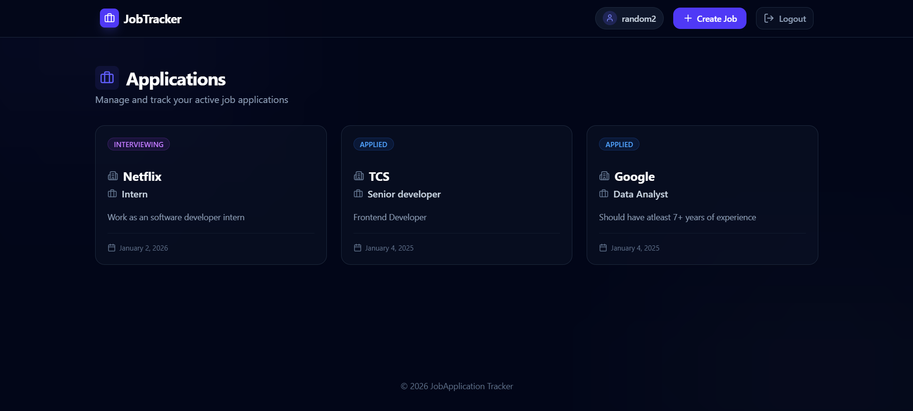
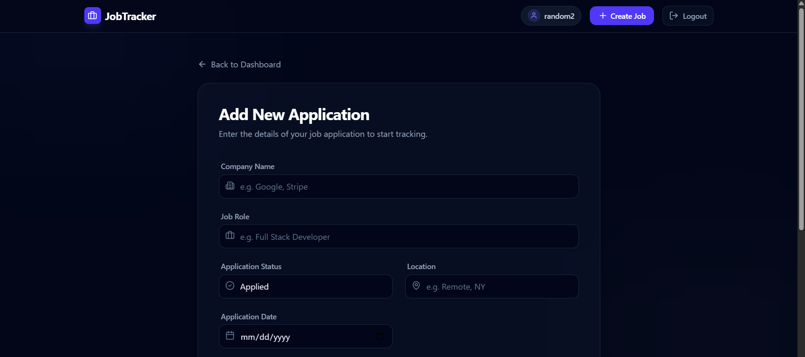
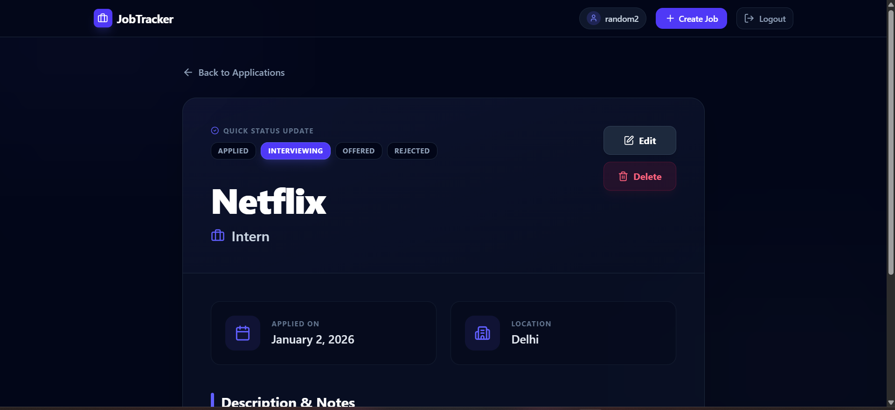
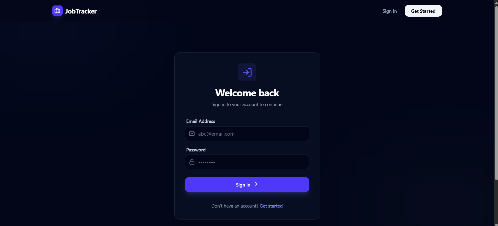

# 💼 JobApplication Tracker - Full-Stack Job Portal

**JobApplication Tracker** is a modern MERN (MongoDB, Express, React, Node.js) application designed for seamless career management. Featuring a "Deep Midnight" dark theme, the platform offers high performance, secure authentication, and a clean, classy interface for tracking job applications from start to finish.

---

## 🖥️ Screenshots

### 🏠 Main Dashboard


### 📊 Application Create Page


### 📊 Application Details & Status Management


### 🔑 Authentication (Login & Register)


---

## 🚀 Key Features

- **Classy Dark UI:** A "Deep Midnight" aesthetic built with Tailwind CSS, featuring subtle radial gradients and glassmorphism for eye comfort.
- **Real-Time Tracking:** Monitor your progress through different hiring stages with color-coded status indicators.
- **Quick Status Updates:** Change the status of an application directly from the details page without filling out complex forms.
- **Secure Authentication:** JWT-based authentication with state managed globally via Zustand.
- **Functional Iconography:** Integrated Lucide React icons that are not only decorative but functional (e.g., clicking the calendar icon triggers the date picker).
- **Responsive Design:** Fully optimized for mobile, tablet, and desktop views.

---

## 🛠️ Tech Stack

### Frontend
- **React.js** (Vite)
- **Tailwind CSS** (Custom Dark Theme & Antialiasing)
- **Zustand** (Global State Management)
- **Axios** (API Requests)
- **Lucide React** (Modern Functional Iconography)
- **React Hot Toast** (Elegant Notifications)

### Backend
- **Node.js** & **Express.js**
- **MongoDB** & **Mongoose** (NoSQL Database)
- **JWT** (Secure Token-based Auth)
- **Bcryptjs** (Password Hashing)

---

## 🌐 Live Demo

> 🚀 [JobTrack Live](https://job-application-tracker-gilt-three.vercel.app/)  
> backend (https://job-application-tracker-s0rm.onrender.com)
> *(Hosted using Render / Vercel — may take a few seconds to wake up if idle)*

---

## 📦 Installation & Setup

### 1. Clone the repository
```bash
git clone [https://github.com/Priyanshu-010/Job-Application-Tracker.git](https://github.com/Priyanshu-010/Job-Application-Tracker.git)
cd Job-Application-Tracker

2. Backend Setup
Navigate to the backend folder: cd backend

Install dependencies: npm install

Create a .env file and add:

PORT=3000
MONGO_URI=your_mongodb_connection_string
SECRET_KEY=your_jwt_secret

Start the server: npm run dev

3. Frontend Setup

Navigate to the frontend folder: cd ../frontend

Install dependencies: npm install

Start the app: npm run dev

---

## 👤 About the Developer

**Priyanshu Rai** 📧 [priyanshurai2772@gmail.com](mailto:priyanshurai2772@gmail.com)  
🔗 [LinkedIn](https://www.linkedin.com/in/priyanshuraidev/)  
💻 [GitHub](https://github.com/Priyanshu-010)

---